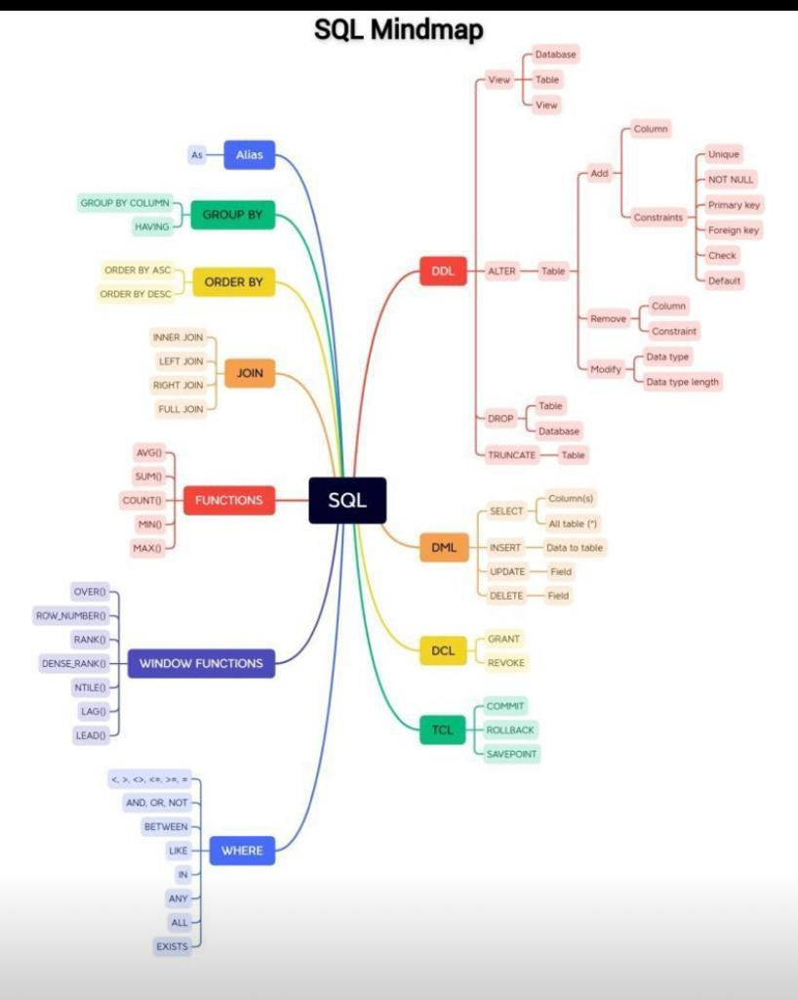

## BASIC SQL TOPICS
## DD USE AdventureWorks2019

### TOPICS WILL COVER 




### DQL DATA QUERY LANGUAGE SELECT STATMENT

```
 SELECT * FROM [Person].[Address]
```

### DDL DATA DEFINITION LANGUAGE CREATE, ALTER, AND DROP

### DATA MANIPULATION LANGUAGE INSERT, UPDATE AND DELETE 


### WRITING OPTIMIZED QUERIES

#### JOINS 

1. Using Bitmaps Index and BTree  for joins optimizes the queries
 


 #### USING WHERE CLAUSE

2. Usung SARGALE "Search ARGuement ABLE"queries, Its best to use Indexes in the here clause this way Where clause is optimized.
3. WHERE order_date > '2023-01-01' SARGALE 
4. WHERE YEAR(order_date) >= 2023   NON-SARGALE


The 1st runs fastw because the Where filter works with the Index but the second query the WHERE clause works with the Function YEAR() this way the function needs to run for every filter.


#### TIPS TO WRITE SARGALE QUERIES:

1. Avoid using Functions in filter or where clause
2. Compare and filter values directly 
3.  If we need a function we can use row functions or functions in the query that way we dont run functons while we filter
4. Avoid using Order by to return larg data set insted we use Limit so we return smaller datasets
5. EXPLAIN can be used to see how the query runs.


